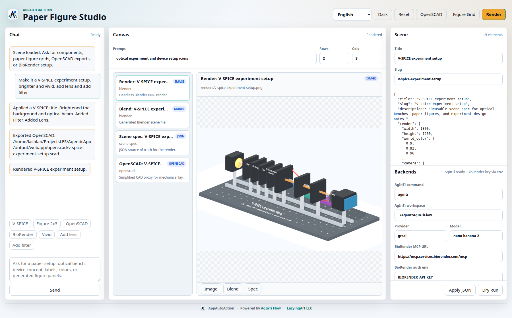
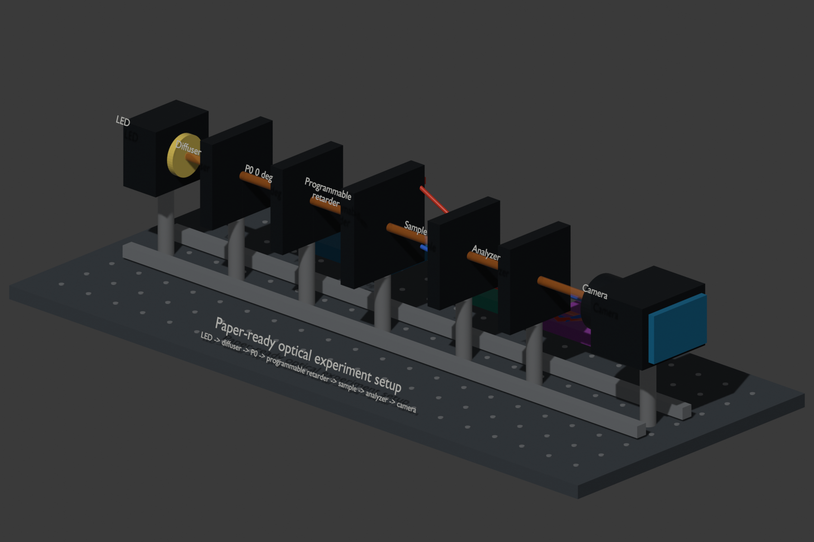

[English](README.md) · [العربية](i18n/README.ar.md) · [Español](i18n/README.es.md) · [Français](i18n/README.fr.md) · [日本語](i18n/README.ja.md) · [한국어](i18n/README.ko.md) · [Tiếng Việt](i18n/README.vi.md) · [中文 (简体)](i18n/README.zh-Hans.md) · [中文（繁體）](i18n/README.zh-Hant.md) · [Deutsch](i18n/README.de.md) · [Русский](i18n/README.ru.md)

<p align="center">
  <a href="https://lazying.art"></a>
  <a href="https://github.com/lachlanchen/AppAutoAction/actions"></a>
  
  
</p>

<h1 align="center">AppAutoAction</h1>

<p align="center">
  Agent routing for Blender, BioRender, Unity, Unreal, and future creative tools.
  AppAutoAction gives Codex, AgInTiFlow, Claude, local LLMs, and other MCP-aware agents one practical control plane for app automation.
</p>

<p align="center">
  <a href="#quick-start">Quick Start</a> ·
  <a href="#paper-figure-studio">Paper Figures</a> ·
  <a href="#3d-experiment-design">3D Design</a> ·
  <a href="#targets">Targets</a> ·
  <a href="#research-backed-design">Research</a> ·
  <a href="#languages">Languages</a>
</p>

<p align="center">
  
</p>

<p align="center">
  Live studio demo: chat asks for a V-SPICE experiment setup, OpenSCAD exports the CAD proxy, and Blender renders the selected right-side canvas artifact.
</p>

## Why This Exists

Creative tools are gaining agent bridges, but each bridge has a different install path, port, protocol, and safety model. AppAutoAction keeps those targets in one registry, validates them, emits MCP client config, and dispatches dry-run or live JSON envelopes to the right adapter.

It is intentionally small: Python standard library, explicit config, no hidden editor automation.

## Quick Start

```bash
PYTHONPATH=src python -m agenticapp list
PYTHONPATH=src python -m agenticapp doctor
PYTHONPATH=src python -m agenticapp dispatch blender "Create a red cube at the origin" --dry-run
PYTHONPATH=src python -m agenticapp mcp-config
PYTHONPATH=src python -m agenticapp studio status
PYTHONPATH=src python -m unittest discover -s tests
```

After installation, the console command is also available as:

```bash
app-auto-action list
app-auto-action dispatch unity "Create a test scene with three labeled cubes" --dry-run
app-auto-action studio figure-grid "optical device icons 2x3" --rows 2 --cols 3
app-auto-action webapp start --port 19473
```

## Paper Figure Studio

```bash
app-auto-action web --port 8787 --open
```

The web app now has a bright-by-default theme, chat panel, artifact canvas, scene editor, and backend settings. It can:

- Treat generated overview images as concepts, then decompose them into editable atomic parts.
- Generate exact `NxM` SVG paper-figure grids with black panel boundaries.
- Prepare AgInTi image-generation dry-run payloads for scientific icon concepts.
- Store BioRender MCP settings without storing secrets.
- Export the current scene to OpenSCAD for mechanical layout planning.
- Render the scene through Blender and preview PNG, `.blend`, `.scad`, JSON, and text artifacts.
- Toggle Blender, OpenSCAD, AgInTi image generation, BioRender MCP, and target-registry routing settings.
- Dry-run any configured target from the studio and save the dispatch envelope as a canvas artifact.

Artifacts are tracked under `output/webapp/artifacts.json` and served in the canvas rail. The intended figure architecture is documented in [docs/EDITABLE_FIGURE_PIPELINE.md](docs/EDITABLE_FIGURE_PIPELINE.md). See also [docs/PAPER_FIGURE_STUDIO.md](docs/PAPER_FIGURE_STUDIO.md), [docs/STUDIO_CLI.md](docs/STUDIO_CLI.md), and [docs/WEBAPP.md](docs/WEBAPP.md).

## 3D Experiment Design

<p align="center">
  
</p>

AppAutoAction now includes a systematic Blender workflow for paper setup figures, optical benches, device concepts, and experiment design:

```bash
app-auto-action web --port 8787 --open
app-auto-action scene-template experiment-setup --output my-setup.scene.json
app-auto-action render-scene my-setup.scene.json --dry-run
app-auto-action render-scene my-setup.scene.json --output-dir output/scenes
```

The web app provides chat, JSON scene editing, dry-run planning, and render preview. The source of truth is a JSON scene spec. Blender runs headless and produces a `.png` preview plus a `.blend` scene. Start from [examples/paper-optics-setup.scene.json](examples/paper-optics-setup.scene.json), inspect the generated [example render](examples/renders/paper-optics-setup.png), or read [docs/WEBAPP.md](docs/WEBAPP.md) and [docs/SCENE_SPEC.md](docs/SCENE_SPEC.md).

## Local Blender Test

For a no-sudo local Blender install and a real headless scene generation test:

```bash
scripts/install_blender_portable.sh
app-auto-action --config configs/blender-local-command.example.json doctor
app-auto-action --config configs/blender-local-command.example.json dispatch blender "Draw a welcoming modern building with a tower"
```

The command bridge is [bridges/codex_exec_blender.sh](bridges/codex_exec_blender.sh). It reads the AppAutoAction JSON envelope from stdin, runs Blender in background mode, stores Blender logs under `output/blender/`, and returns clean JSON with `.blend` and `.png` artifact paths.

## Targets

| Target | Current adapter | Best bridge shape | Notes |
| --- | --- | --- | --- |
| Blender | `http_json` | Blender MCP add-on, local HTTP, or command bridge | Good for scene generation, materials, rendering, export. |
| AgInTi | `local_command` via web settings | `aginti image --json` | Dry-run image payloads for figure concepts; live calls require provider keys. |
| BioRender | `browser` plus MCP metadata | Official remote MCP connector | Use OAuth/API-supported flows; avoid scraping. |
| Unity | `http_json` | Unity package, WebSocket proxy, or C# editor bridge | Good for scenes, assets, scripts, tests, play mode. |
| Unreal | `http_json` | Unreal MCP plugin or Python remote execution proxy | Treat as privileged editor access. |

Copy `configs/targets.example.json` to `agenticapp.targets.json` for local ports, commands, and tokens. This override file is ignored by git.

## Research-Backed Design

The design follows the MCP split between tools, resources, and prompts, then adapts it to live editor bridges. The research brief is in [docs/RESEARCH.md](docs/RESEARCH.md), covering:

- Blender MCP projects with headless and live-GUI modes.
- Unity MCP packages with scene, asset, script, and play-mode control.
- Unreal MCP servers using plugins or Python Remote Execution.
- BioRender's documented MCP connector endpoint.
- Security tradeoffs for agents with editor write access.

## Architecture

```text
Agent or MCP client
        |
        | command / dry-run / MCP config
        v
AppAutoAction CLI
        |
        | target registry
        v
Transport adapter: http_json | local_command | browser | noop
        |
        v
Blender / BioRender / Unity / Unreal bridge
```

Every dispatch receives the same envelope:

```json
{
  "target": "blender",
  "kind": "blender",
  "instruction": "Create a red cube at the origin",
  "payload": {},
  "metadata": {
    "source": "agenticapp"
  }
}
```

## Languages

Localized READMEs live under `i18n/` and use the same profile-style language switcher as this root README:

[العربية](i18n/README.ar.md) · [Español](i18n/README.es.md) · [Français](i18n/README.fr.md) · [日本語](i18n/README.ja.md) · [한국어](i18n/README.ko.md) · [Tiếng Việt](i18n/README.vi.md) · [中文 (简体)](i18n/README.zh-Hans.md) · [中文（繁體）](i18n/README.zh-Hant.md) · [Deutsch](i18n/README.de.md) · [Русский](i18n/README.ru.md)

## Development

```bash
PYTHONPATH=src python -m unittest discover -s tests
PYTHONPATH=src python -m agenticapp doctor
```

Keep transport behavior covered by tests before adding live editor features. See [AGENTS.md](AGENTS.md) for contributor guidance and [SECURITY.md](SECURITY.md) for the editor-automation security model.
