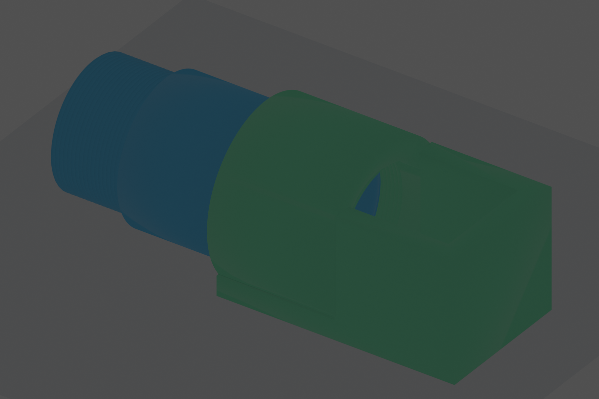
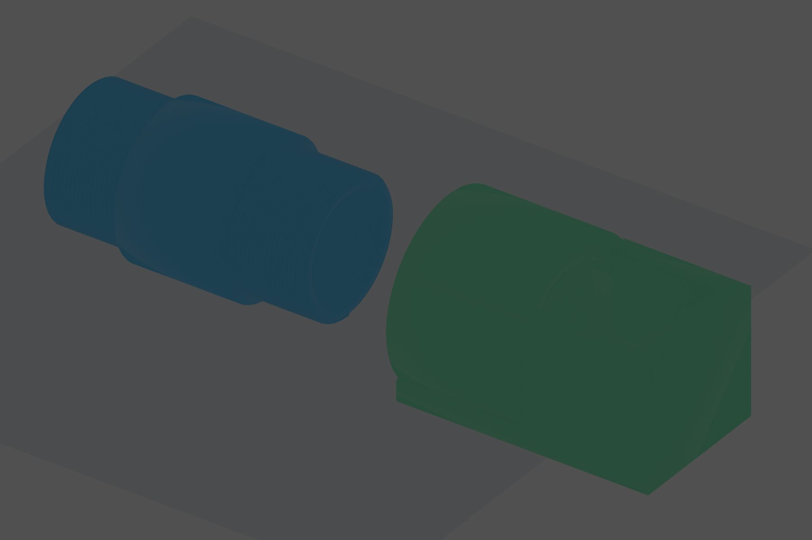

# C-Mount Threaded Reflector Assembly

This is a new two-part design. It does not replace `../cmount_reflector_adapter/`.

Current printable version: `artifacts/v2_15mm_threads_print_fit/`.





## Artifact Versions

| Version | Folder | Summary |
| --- | --- | --- |
| v1 | `artifacts/v1_20mm_threads/` | Previous 50 mm tube with `20 mm` threads at both ends, `10 mm` center body, `20 x 20 x 20 mm` reflector pocket, and earlier C-mount pitch assumption. |
| v2 | `artifacts/v2_15mm_threads_print_fit/` | Current design: `15 mm` male threads on both ends, `20 mm` center body, max `20 mm` internal female thread, `20.4 x 20.4 x 20.4 mm` reflector pocket, and old-reference print-fit diameters. |

## Design Intent

From left to right:

1. A `50 mm` tube with male C-mount-like threads on both ends.
2. Each male threaded section is `15 mm` long.
3. The center tube body is `20 mm` long.
4. The tube left end mates to the old 4f system female C-mount side.
5. The tube right end threads into the reflector holder's female socket.
6. The reflector holder is a top-open box for a nominal `20 x 20 x 20 mm` reflector with `0.4 mm` total pocket clearance.
7. From the reflector view, the holder is top-open and left-open through the threaded tube socket.

## Old 4f Design Evidence

The local OpenHI/Nature STEP files use millimetre units. OpenHI has the cleanest one-part measurements; Nature repeats the same labels inside larger assemblies. The exact thread labels found in the old branch files are:

| Old file | STEP solid labels |
| --- | --- |
| `OpenHI_STEP/A.step` | `Thread top` |
| `OpenHI_STEP/B.step` | `Thread camera 24.4`, `Thread lens 29.6*` |
| `OpenHI_STEP/C.step` | `Thread camera 24.4`, `Thread lens 29.6` |
| `OpenHI_STEP/Collimator tube.step` | `Outer thread`, `Thread left 24.8` |
| `OpenHI_STEP/Collimator cap.step` | `Cap thread 24.8` |
| `Nature_STEP/BS lateral.step.step` | repeated `Thread camera 24.4`, `Thread lens 29.6`, `Thread top`, `Thread BS` |

Measured OpenHI mating/thread bodies:

| Fit role | Old evidence | Measured body envelope | v2 rule |
| --- | --- | ---: | --- |
| Camera/C-mount male root | `Thread camera 24.4` in B/C | about `25.2 x 25.4 x 5.1 mm` thread envelope | use `24.4 mm` male root, `25.2 mm` crest |
| Matching female/cutter root | `Thread left 24.8`, `Cap thread 24.8` | about `25.6 x 25.4 x 5.8 mm` thread envelope | use `24.8 mm` female bore/root, `25.6 mm` groove cutter crest |
| Larger lens/BS/top thread | `Thread lens 29.6`, `Thread top`, `Thread BS`, `Outer thread` | about `30.6 x 30.9 mm` crest envelope | keep `29.6 mm` root when adapting old 4f parts |
| Square branch bodies | `Lens B/C camera`, `Scope fittings`, `T branch head` | exact `40 x 40 mm` cross sections | keep inserted part exact; add clearance to receiving pockets |

The old STEP text also exposes the thread tooth triangle: two side vectors are `0.565685 mm` at 45 degrees, and the base vector is `0.8 mm`. That corresponds to a `0.4 mm` radial tooth height, `0.8 mm` tooth base, and `0.8 mm` pitch/gap. Detailed measurements are maintained in `../../references/openhi-print-fit-and-thread-reference.md`.

## Why The Earlier Render Looked Smooth

The first render showed the assembly already threaded together. That hides the right male thread inside the holder, and the female groove is inside the socket. The first STEP files were also smooth envelope STEP files for CAD review, not fully threaded BReps. The current artifacts include `threaded_reflector_assembly_threaded.step`, a single STEP assembly with explicit male thread ridges and female groove-cut geometry.

## Dimensions

| Feature | Value |
| --- | ---: |
| Tube total length | `50 mm` |
| Left male thread length | `15 mm` |
| Center body length | `20 mm` |
| Right male thread length | `15 mm` |
| Tube bore | `20 mm` |
| Tube body OD | `28.4 mm` |
| Printed male thread root OD | `24.4 mm` |
| Printed male thread crest OD | `25.2 mm` |
| Holder female bore/root OD | `24.8 mm` |
| Holder female groove cutter crest OD | `25.6 mm` |
| Male thread length inside holder | `15 mm` |
| Maximum internal female thread length | `20 mm` |
| Thread pitch | `0.8 mm` |
| Thread tooth triangle | `0.4 mm` high, `0.8 mm` base |
| Reflector inner pocket | `20.4 x 20.4 x 20.4 mm` |
| Holder wall | `4 mm` |
| Holder top | open |
| Holder left side | open through threaded socket |
| Optical axis height | `14.2 mm` |
| Assembly bounds | `83.4 x 34.0 x 31.2 mm` |

The holder wall is thicker than the requested minimum. The `28.4 mm` tube center body is derived from the `14.2 mm` optical-axis height, so its bottom is exactly on the same `Z=0` plane as the reflector holder bottom when installed. Both male threads are modeled right-hand when viewed from their engaging end. The right-end thread is mirrored so it mates naturally with the left-facing female socket on the holder.

## Files

- `threaded_reflector_assembly.scad`: printable source with helical thread approximation.
- `analyze_reference_steps.py`: local helper for regenerating the old STEP solid measurement table.
- `generate_support_artifacts.py`: STEP envelope, SVG, DXF, and PDF drawing generator.
- `blender_render.py`: headless Blender render from the generated STL parts.
- `artifacts/v2_15mm_threads_print_fit/male_male_cmount_tube.stl`: printable threaded tube.
- `artifacts/v2_15mm_threads_print_fit/top_open_reflector_holder.stl`: printable reflector holder.
- `artifacts/v2_15mm_threads_print_fit/threaded_reflector_assembly.stl`: assembly preview only.
- `artifacts/v2_15mm_threads_print_fit/threaded_reflector_assembly_threaded.step`: single STEP assembly containing both parts with modeled thread geometry.
- `artifacts/v2_15mm_threads_print_fit/*_threaded.step`: individual threaded STEP parts.
- `artifacts/v2_15mm_threads_print_fit/*_envelope.step`: smooth STEP envelope files for lightweight CAD review.
- `artifacts/v2_15mm_threads_print_fit/*.svg`, `*.pdf`, `*.png`, `*.dxf`: support drawings.

## Editable Decomposition Outputs

The v2 folder also includes same-coordinate STEP parts for Boolean reconstruction and exploded STEP files for visual inspection.

Tube recipe:

- `male_male_cmount_tube_decomposed.step`: named STEP assembly with `tube_base_no_threads`, `left_male_thread_add`, and `right_male_thread_add` in the correct coordinates.
- `male_male_cmount_tube_decomposed_exploded.step`: same three objects offset for inspection.
- `tube_base_no_threads.step/.stl`: hollow tube body without thread ridges.
- `tube_left_male_thread.step/.stl` and `tube_right_male_thread.step/.stl`: standalone male thread solids. The STL files are exported from OpenSCAD so the twisted thread ends are capped and watertight.

Holder recipe:

- `top_open_reflector_holder_boolean_recipe.step`: shows `holder_base_solid_before_subtraction`, `holder_smooth_bore_base`, `female_thread_cutter_subtract`, and `threaded_holder_result`.
- `top_open_reflector_holder_decomposed.step`: same-coordinate separate objects for the cube shell, socket cylinder, bottom reinforcement, bore cutter, and female thread cutter.
- `top_open_reflector_holder_decomposed_exploded.step`: offset version for inspection.
- `holder_smooth_bore_base.step/.stl - holder_female_thread_cutter.step/.stl = top_open_reflector_holder_threaded.step`.
- `holder_full_thread_cutter.step/.stl`: combined bore plus female thread cutter for subtracting from the fully solid holder base.

Sketches:

- `thread_profile_sketch.svg/.pdf/.png`: triangular tooth profile, `0.8 mm` base/pitch and `0.4 mm` height.
- `decomposition_recipe_sketch.svg/.pdf/.png`: visual recipe for adding the tube threads and subtracting the holder female thread cutter.

DWG is not generated because it is proprietary; use the DXF sketch for CAD import.

## Generate

```bash
mkdir -p cad/designs/cmount_threaded_reflector_assembly/artifacts/v2_15mm_threads_print_fit
openscad -D 'part="tube"' -o cad/designs/cmount_threaded_reflector_assembly/artifacts/v2_15mm_threads_print_fit/male_male_cmount_tube.stl cad/designs/cmount_threaded_reflector_assembly/threaded_reflector_assembly.scad
openscad -D 'part="holder"' -o cad/designs/cmount_threaded_reflector_assembly/artifacts/v2_15mm_threads_print_fit/top_open_reflector_holder.stl cad/designs/cmount_threaded_reflector_assembly/threaded_reflector_assembly.scad
openscad -D 'part="assembly"' -o cad/designs/cmount_threaded_reflector_assembly/artifacts/v2_15mm_threads_print_fit/threaded_reflector_assembly.stl cad/designs/cmount_threaded_reflector_assembly/threaded_reflector_assembly.scad
openscad -D 'part="exploded"' -o cad/designs/cmount_threaded_reflector_assembly/artifacts/v2_15mm_threads_print_fit/threaded_reflector_exploded.stl cad/designs/cmount_threaded_reflector_assembly/threaded_reflector_assembly.scad
cad/.conda/cad-python/bin/python cad/designs/cmount_threaded_reflector_assembly/generate_support_artifacts.py
blender --background --python cad/designs/cmount_threaded_reflector_assembly/blender_render.py
cad/.conda/cad-python/bin/python cad/designs/cmount_threaded_reflector_assembly/analyze_reference_steps.py
```

Print the tube and holder as separate parts. Use the assembly STL only as a visual fit check.

Useful OpenSCAD decomposition switches:

```bash
openscad -D 'part="tube_base"' -o /tmp/tube_base.stl cad/designs/cmount_threaded_reflector_assembly/threaded_reflector_assembly.scad
openscad -D 'part="tube_left_thread"' -o /tmp/tube_left_thread.stl cad/designs/cmount_threaded_reflector_assembly/threaded_reflector_assembly.scad
openscad -D 'part="tube_right_thread"' -o /tmp/tube_right_thread.stl cad/designs/cmount_threaded_reflector_assembly/threaded_reflector_assembly.scad
openscad -D 'part="holder_smooth_bore"' -o /tmp/holder_smooth_bore.stl cad/designs/cmount_threaded_reflector_assembly/threaded_reflector_assembly.scad
openscad -D 'part="holder_thread_cutter"' -o /tmp/holder_thread_cutter.stl cad/designs/cmount_threaded_reflector_assembly/threaded_reflector_assembly.scad
```
