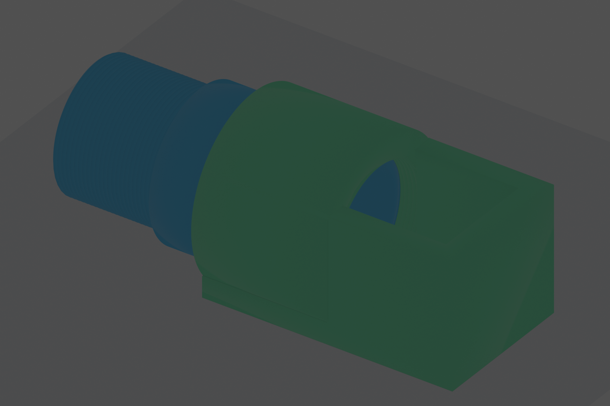
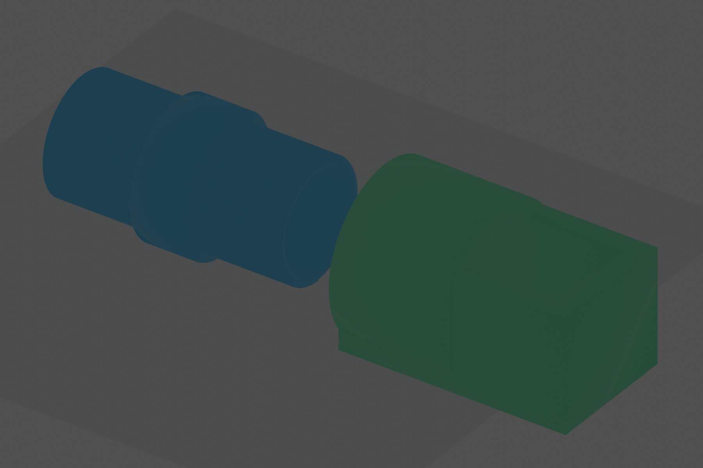

# C-Mount Threaded Reflector Assembly

This is a new two-part design. It does not replace `../cmount_reflector_adapter/`.





## Design Intent

From left to right:

1. A `50 mm` tube with male C-mount-like threads on both ends.
2. Each threaded section is `20 mm` long.
3. The center tube body is `10 mm` long.
4. The tube left end mates to the old 4f system female C-mount side.
5. The tube right end threads into the reflector holder's female socket.
6. The reflector holder is a top-open box for a `20 x 20 x 20 mm` reflector.
7. From the reflector view, the holder is top-open and left-open through the threaded tube socket.

## Old 4f Design Evidence

The local OpenHI/Nature STEP files use millimetre units. The exact thread labels found in the old branch files are:

| Old file | STEP solid labels |
| --- | --- |
| `OpenHI_STEP/A.step` | `Thread top` |
| `OpenHI_STEP/B.step` | `Thread camera 24.4`, `Thread lens 29.6*` |
| `OpenHI_STEP/C.step` | `Thread camera 24.4`, `Thread lens 29.6` |
| `OpenHI_STEP/Collimator tube.step` | `Outer thread`, `Thread left 24.8` |
| `OpenHI_STEP/Collimator cap.step` | `Cap thread 24.8` |
| `Nature_STEP/BS lateral.step.step` | repeated `Thread camera 24.4`, `Thread lens 29.6`, `Thread top`, `Thread BS` |

Imported bounding boxes for the old A/B/C STEP branches:

| Old branch | Bounding box |
| --- | --- |
| `A.step` | `40 x 40 x 50 mm` |
| `B.step` | `40 x 40 x 54.4 mm` |
| `C.step` | `54 x 40 x 40 mm` |

The new tube therefore uses `24.4 mm` printed male major diameter for the old camera/C-mount side, with standard C-mount pitch `25.4 / 32 = 0.79375 mm`. The reflector holder's female socket uses a `24.8 mm` thread cutter, matching the old `Thread left 24.8` / `Cap thread 24.8` print-clearance pattern.

## Why The Earlier Render Looked Smooth

The first render showed the assembly already threaded together. That hides the right male thread inside the holder, and the female groove is inside the socket. The first STEP files were also smooth envelope STEP files for CAD review, not fully threaded BReps. The current artifacts include `threaded_reflector_assembly_threaded.step`, a single STEP assembly with explicit male thread ridges and female groove-cut geometry.

## Dimensions

| Feature | Value |
| --- | ---: |
| Tube total length | `50 mm` |
| Left male thread length | `20 mm` |
| Center body length | `10 mm` |
| Right male thread length | `20 mm` |
| Tube bore | `20 mm` |
| Tube body OD | `28 mm` |
| Printed male thread major OD | `24.4 mm` |
| Holder female thread cutter OD | `24.8 mm` |
| Thread pitch | `0.79375 mm` |
| Reflector inner pocket | `20 x 20 x 20 mm` |
| Holder wall | `4 mm` |
| Holder top | open |
| Holder left side | open through threaded socket |
| Optical axis height | `14 mm` |

The holder wall is thicker than the requested minimum. This makes the tube center body `28 mm` OD around the `20 mm` bore, giving a `4 mm` tube wall and placing the center body bottom exactly on the same `Z=0` plane as the reflector holder bottom when installed. Both male threads are modeled right-hand when viewed from their engaging end. The right-end thread is mirrored so it mates naturally with the left-facing female socket on the holder.

## Files

- `threaded_reflector_assembly.scad`: printable source with helical thread approximation.
- `generate_support_artifacts.py`: STEP envelope, SVG, DXF, and PDF drawing generator.
- `blender_render.py`: headless Blender render from the generated STL parts.
- `artifacts/male_male_cmount_tube.stl`: printable threaded tube.
- `artifacts/top_open_reflector_holder.stl`: printable reflector holder.
- `artifacts/threaded_reflector_assembly.stl`: assembly preview only.
- `artifacts/threaded_reflector_assembly_threaded.step`: single STEP assembly containing both parts with modeled thread geometry.
- `artifacts/*_threaded.step`: individual threaded STEP parts.
- `artifacts/*_envelope.step`: smooth STEP envelope files for lightweight CAD review.
- `artifacts/*.svg`, `*.pdf`, `*.png`, `*.dxf`: support drawings.

DWG is not generated because it is proprietary; use the DXF sketch for CAD import.

## Generate

```bash
openscad -D 'part="tube"' -o cad/designs/cmount_threaded_reflector_assembly/artifacts/male_male_cmount_tube.stl cad/designs/cmount_threaded_reflector_assembly/threaded_reflector_assembly.scad
openscad -D 'part="holder"' -o cad/designs/cmount_threaded_reflector_assembly/artifacts/top_open_reflector_holder.stl cad/designs/cmount_threaded_reflector_assembly/threaded_reflector_assembly.scad
openscad -D 'part="assembly"' -o cad/designs/cmount_threaded_reflector_assembly/artifacts/threaded_reflector_assembly.stl cad/designs/cmount_threaded_reflector_assembly/threaded_reflector_assembly.scad
cad/.conda/cad-python/bin/python cad/designs/cmount_threaded_reflector_assembly/generate_support_artifacts.py
blender --background --python cad/designs/cmount_threaded_reflector_assembly/blender_render.py
```

Print the tube and holder as separate parts. Use the assembly STL only as a visual fit check.
