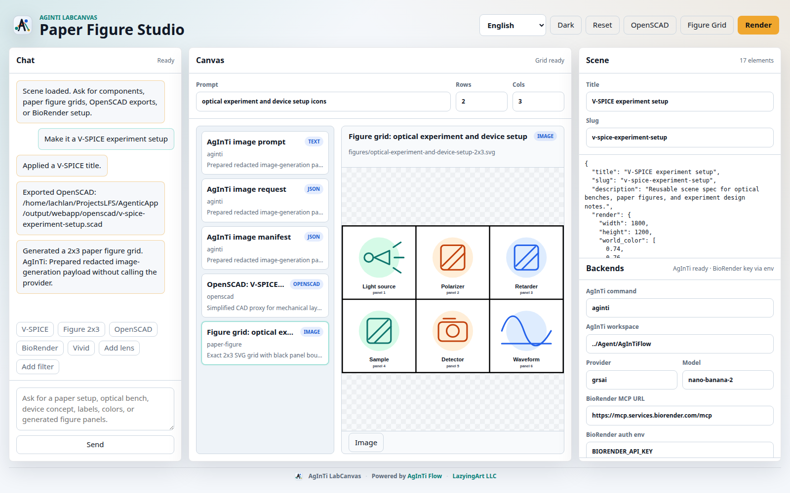

[English](../README.md) · [العربية](README.ar.md) · [Español](README.es.md) · [Français](README.fr.md) · [日本語](README.ja.md) · [한국어](README.ko.md) · [Tiếng Việt](README.vi.md) · [中文 (简体)](README.zh-Hans.md) · [中文（繁體）](README.zh-Hant.md) · [Deutsch](README.de.md) · [Русский](README.ru.md)

<p align="center">
  <a href="https://lazying.art"></a>
  <a href="https://github.com/lachlanchen/AgInTi-LabCanvas/actions"></a>
  
  
</p>

<h1 align="center">AgInTi LabCanvas</h1>

<p align="center">
  توجيه الوكلاء إلى Blender و BioRender و Unity و Unreal وأدوات الإبداع والبحث العلمي.
</p>

<p align="center">
  
</p>

## لماذا يوجد هذا المشروع

يوفر AgInTi LabCanvas لوحة تحكم عملية لـ Codex و AgInTiFlow و Claude والوكلاء المتوافقين مع MCP. يحتفظ المشروع بالأهداف في سجل واضح، ويتحقق من الإعدادات، ويرسل أوامر JSON قابلة للمراجعة إلى المحول المناسب.

## البدء السريع

```bash
PYTHONPATH=src python -m agenticapp list
PYTHONPATH=src python -m agenticapp doctor
PYTHONPATH=src python -m agenticapp dispatch blender "Create a red cube at the origin" --dry-run
PYTHONPATH=src python -m agenticapp studio status
PYTHONPATH=src python -m unittest discover -s tests
```

بعد التثبيت:

```bash
labcanvas studio figure-grid "optical device icons 2x3" --rows 2 --cols 3
labcanvas webapp start --port 19473
```

## استوديو الأشكال العلمية

يحتوي تطبيق الويب على دردشة، ولوحة للنتائج، ومحرر JSON للمشهد، وإعدادات للخلفيات. يمكنه إنشاء شبكات SVG دقيقة بحجم `NxM`، وتحضير طلبات صور AgInTi، وحفظ إعدادات BioRender دون أسرار، وتصدير OpenSCAD، ورندر المشاهد عبر Blender.

راجع [PAPER_FIGURE_STUDIO.md](../docs/PAPER_FIGURE_STUDIO.md)، و [STUDIO_CLI.md](../docs/STUDIO_CLI.md)، و [WEBAPP.md](../docs/WEBAPP.md).

## تصميم التجارب ثلاثية الأبعاد

```bash
labcanvas scene-template experiment-setup --output my-setup.scene.json
labcanvas render-scene my-setup.scene.json --dry-run
labcanvas render-scene my-setup.scene.json --output-dir output/scenes
```

مصدر الحقيقة هو ملف مواصفة مشهد بصيغة JSON. يعمل Blender بدون واجهة وينتج معاينة `.png` وملف مشهد `.blend`. ابدأ من [paper-optics-setup.scene.json](../examples/paper-optics-setup.scene.json).

## الأهداف

| الهدف | المحول | الاستخدام الرئيسي |
| --- | --- | --- |
| Blender | `http_json` أو أمر محلي | المشاهد والمواد والرندر والتصدير. |
| AgInTi | أمر محلي | أفكار صور للأشكال العلمية. |
| BioRender | المتصفح و MCP | الرسومات الأكاديمية عبر المسار الرسمي. |
| Unity | `http_json` | المشاهد والأصول والسكربتات والاختبارات. |
| Unreal | `http_json` | التحكم في المحرر بصلاحيات واضحة. |

## التطوير

```bash
PYTHONPATH=src python -m unittest discover -s tests
PYTHONPATH=src python -m agenticapp doctor
```

اقرأ [AGENTS.md](../AGENTS.md) لإرشادات المساهمة و [SECURITY.md](../SECURITY.md) لنموذج الأمان.
