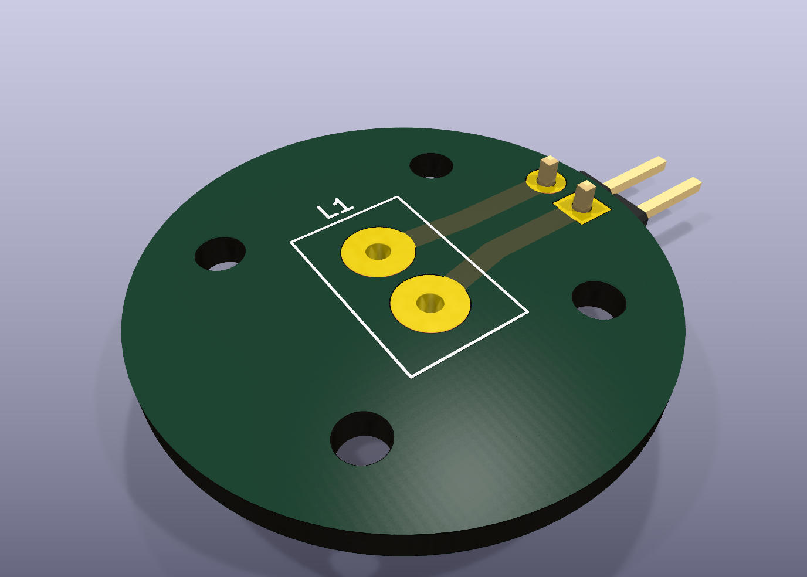

# HYBEC HBL-273 / HBL-667 G4 Halogen Carrier PCB




This generated KiCad project adapts the existing NHI LED carrier style to a
two-hole direct-insertion G4 halogen lamp footprint.

- Board outline: circular, 24 mm diameter, matching the old LED carrier files.
- Mounting holes: four M2 NPTH holes at the same coordinates as the old boards.
- Lamp pins: two 1.20 mm plated holes on 4.00 mm G4 pitch.
- Power path: 1.20 mm top-layer copper tracks from the rear 1x02 input header.
- Lamp: 12 V, 20 W tungsten halogen, approximately 1.67 A.

Thermal note: a 20 W halogen lamp runs hot. Treat this PCB as a mechanical and
electrical adapter prototype; verify lamp standoff height, FR4 temperature,
airflow, and enclosure clearance before powering it in an instrument.

## Files

- `hybec-hbl-273-g4.kicad_pcb`: generated KiCad PCB.
- `hybec-hbl-273-hbl-667-lamp-dataset.json`: lamp specification dataset and source links.
- `artifacts/hybec-hbl-273-g4-render.png`: KiCad 3D render for review.
- `artifacts/hybec-hbl-273-g4-render-full.png`: zoomed-out full-board render.
- `artifacts/hybec-hbl-273-g4.step`: STEP export.
- `gerber/`: Gerber and Excellon drill outputs.

## Gerber Outputs

- `hybec-hbl-273-g4-F_Cu.gtl`, `hybec-hbl-273-g4-B_Cu.gbl`
- `hybec-hbl-273-g4-F_Mask.gts`, `hybec-hbl-273-g4-B_Mask.gbs`
- `hybec-hbl-273-g4-F_Silkscreen.gto`, `hybec-hbl-273-g4-B_Silkscreen.gbo`
- `hybec-hbl-273-g4-Edge_Cuts.gm1`
- `hybec-hbl-273-g4-job.gbrjob`
- `hybec-hbl-273-g4.drl`

## Reproduce

```bash
python3 pcb/scripts/generate_hybec_halogen_g4_board.py
kicad-cli pcb drc --format json --severity-all -o pcb/hybec-hbl-273-g4/artifacts/drc.json pcb/hybec-hbl-273-g4/hybec-hbl-273-g4.kicad_pcb
kicad-cli pcb export gerbers --layers F.Cu,B.Cu,F.SilkS,B.SilkS,F.Mask,B.Mask,Edge.Cuts,F.Fab,B.Fab --precision 6 -o pcb/hybec-hbl-273-g4/gerber pcb/hybec-hbl-273-g4/hybec-hbl-273-g4.kicad_pcb
kicad-cli pcb export drill --generate-map --map-format svg --generate-report --report-path pcb/hybec-hbl-273-g4/artifacts/drill-report.txt -o pcb/hybec-hbl-273-g4/gerber pcb/hybec-hbl-273-g4/hybec-hbl-273-g4.kicad_pcb
xvfb-run -a kicad-cli pcb render --output pcb/hybec-hbl-273-g4/artifacts/hybec-hbl-273-g4-render.png --width 1400 --height 1000 --background opaque --quality high --floor --perspective --rotate 315,0,35 --zoom 2.2 pcb/hybec-hbl-273-g4/hybec-hbl-273-g4.kicad_pcb
xvfb-run -a kicad-cli pcb render --output pcb/hybec-hbl-273-g4/artifacts/hybec-hbl-273-g4-render-full.png --width 1400 --height 1000 --background opaque --quality high --floor --perspective --rotate 315,0,35 --zoom 0.95 pcb/hybec-hbl-273-g4/hybec-hbl-273-g4.kicad_pcb
```
